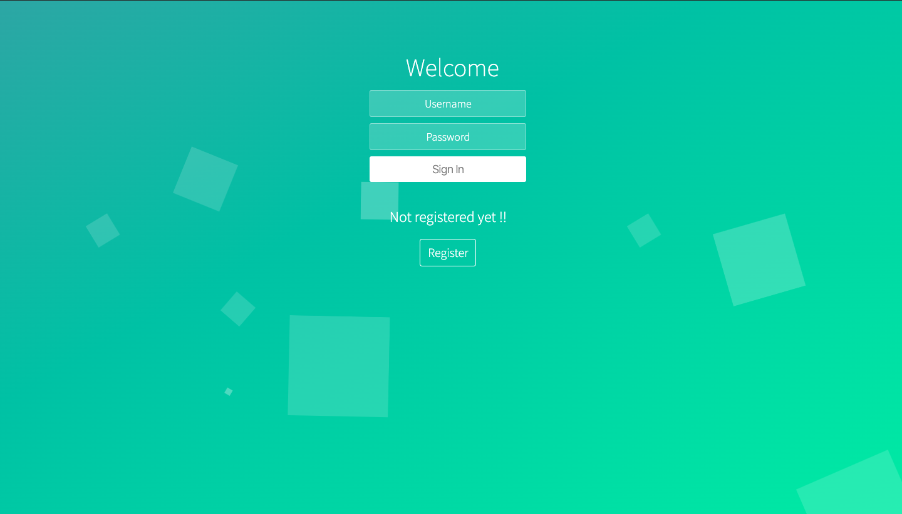

# Video Conferencing
A WebRTC based peer to peer video calling web application. It makes use of sockets for signalling.
##
### Key features
 - **Secure** **Authentication** using Passport.js Local Strategy.
 - **Real time** video calling using **RTC Peer Connection**.
 - Users can set up meeting easily just by tapping a button
 - Multiple users can join a meeting by each logging in using their account credentials and room name to be joined.
##

### Login page
 

### Home page
 

### Made By
 Harsh Kothari
